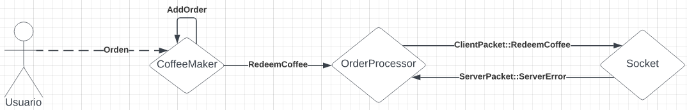

# Coffee Maker

Este modulo se encarga de implementar las cafeteras y su interaccion con el servidor local.

## Protocolo

Para los mensajes locales, ver `src/coffee_maker/messages.rs` y `src/coffee_maker/messages.rs`. Para los mensajes entre la cafetera y el servidor, ver `../common/src/packet.rs`.

### Canjeo de puntos

1. La cafetera envia un mensaje al actor procesador del tipo `RedeemCoffee` con el user_id del comprador y el costo de cafe.
2. El procesador envia un paquete `RedeemCoffee` con la id del usuario, el costo del café y una id única (para esta cafetera) de la transacción.
3. El servidor intenta bloquear los puntos, y responde con un paquete que contiene la mimsa id:
   - Si tiene éxito, responde con un paquete `Ready`
   - Si falla, responde con un paquete `ServerErrror`
4. La cafetera, en caso de haber recibido un `ServerErrror`, aborta la preparación del café, finalizando aquí el proceso. Caso contrario, lo prepara.
5. Si al preparar el café no hay problemas, se envía un mensaje `CommitRedemption` al servidor. Si falla, no se hace nada.
6. El servidor, al recibir el paquete `CommitRedemption`, consume los puntos bloqueados. Si tras un tiempo configurable no se recibió nada más de la cafetera, se liberan los puntos bloqueados.




### Recargas

También se puede agregar puntos a las cuentas de los usuarios mediante el mensaje `AddPoints`. El procesador envia un mensaje al servidor con la cantidad y una id, y el servidor va a agregar el dinero (reintentándolo si esta desconectado en ese momento).


## Configuración

La cafetera recibe como parametro un archivo de configuración tipo JSON. Los parametros son.

`order_from`: Es el path del archivo del cual se van a leer las ordenes para esta cafetera. se le puede pasar "stdin" para que en cambio lea la consola.

`server_ip`: Es el ip y puerto del servidor local al cual se conectará esta cafetera.

`logs`: Dentro se pueden definir donde ira el archivo que guarde los logs, en nivel de logs de este archivo y el nivel de logs de los mostrados por consola.

`fail_probability`: Es la probabilidad de que la cafetera no logre preparar el café. Es un número del 0 al 100.

Para un ejemplo ver [config.js](https://github.com/concurrentes-fiuba/2022-2c-tp2-rostov/blob/main/coffee_maker/config,js)

## Formato de ordenes

Las ordenes son lineas de texto con campos separados por comas. El primer campo define si la orden es una venta de café o una recarga de puntos. De ser una venta el campo será `sale` y de ser una recarga será `recharge`.

### Venta

El seguiente campo cuando se trata de una venta es el nombre del producto comprado, seguido por el id del usuario quien lo esta comprando y finalmente el precio de ese producto. Ejemplo:

```
sale,cafe 1,3,5
```

### Recarga

Las recargas despues tienen el id del usuario quien esta haciendo la recarga de puntos y luego la cantidad de puntos que se estan recargando. Ejemplo:

```
recharge,7,20
```

### Archivo

El archivo con las ordenes tiene que ser de tipo `csv` y tiene que tener una orden por línea. Para ejemplos ver la carpeta [orders](https://github.com/concurrentes-fiuba/2022-2c-tp2-rostov/tree/main/coffee_maker/src/orders).

## Comandos

### Ejecución

```
cargo run [config file]
```

### Tests

```
cargo test
```

### Documentación

```
cargo doc --open
```
