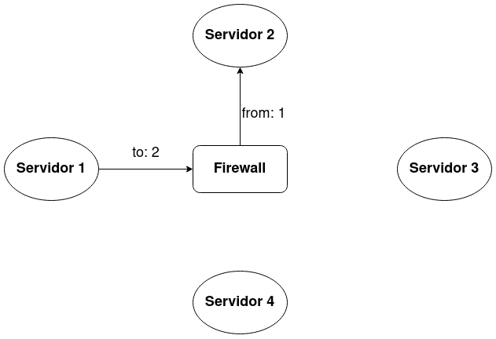
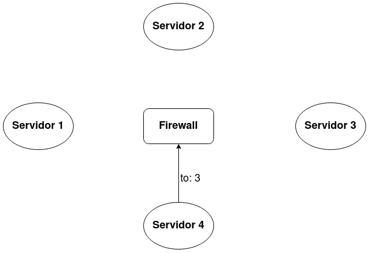

# Firewall

Un firewall cumple la funcion de mediador entre dos servidores. Solo debe utilizarse en un ambiente de pruebas.

Cuando dos servidores se comunican utilizando un `SocketEncoder`, los paquetes se enviarán primero a un proceso
central, llamado Firewall. El Firewall evaluará el conjunto de reglas con que fue configurado, y si el paquete
se encuentra habilitado para enviarse al host de destino, lo reenviará al mismo. De lo contrario, el paquete se
dropea.

Cada vez que un paquete se envía a un destino correctamente (es decir, ninguna regla bloqueó el envío), se notificará
a todas las reglas de dicho evento, pudiendo modificar su estado interno de ser necesario.

Ejemplo de comunicación exitosa entre el servidor 1 y 2. Notar que cada elemento del diagrama es un proceso diferente.

Ejemplo en el cual un paquete es dropeado por el Firewall. esto se debe a que una de las reglas con el que fue configurado, retornó `true` al ejecutar la función `is_matching`.