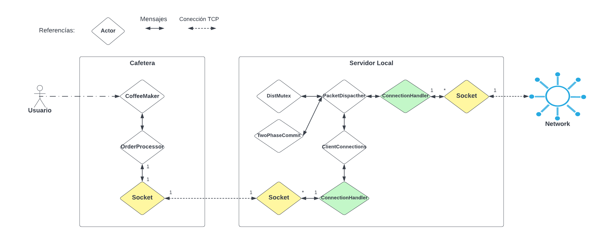

# Internet of Coffee

Internet of Coffee es un sistema distribuido para coordinar la venta de cafés, entre nuestros distintos locales, a nuestros usuarios. Cada usuario tiene sus puntos registrados en el sistema y puede hacer uso de esos puntos en cualquiera de nuestras ubicaciones para comprar cafés.

Cada local cuenta con un servidor local, el cual se comunica con otros servidores para controlar los cambios en el sistema de manera distribuida. Despues cada local tiene una cantidad arbitraria de cafeteras, las cuales reciben los pedidos de los clientes, los verifican con el servidor local y los preparan.

La gran mayoría de este sistema esta implementado usando el modelo de actores y la librería [Actix](https://docs.rs/actix/latest/actix/). A continuación se presenta un diagrama de la arquitectura general del sistema.

Cada uno de los modulos se explica en detalle en el readme de su respectiva carpeta.

## Cafetera

La cafetera es una aplicación que se encarga de recibir ordenes de café, comunicarse con el servidor y preparar el café, su código se encuentra en la carpeta [coffee_maker](https://github.com/concurrentes-fiuba/2022-2c-tp2-rostov/tree/main/coffee_maker) y su documentación en el [readme.md](https://github.com/concurrentes-fiuba/2022-2c-tp2-rostov/blob/main/coffee_maker/readme.md) dentro de la carpeta.

## Servidor

El servidor se comunica con los servidores de todos los otros locales para que cuando un cliente realice una compra y la cafetera le informe, esta se registre en todas las bases de datos y así poder atender usuarios en cualquier lugar sin inconvenientes. Su código se encuentra en la carpeta [server](https://github.com/concurrentes-fiuba/2022-2c-tp2-rostov/tree/main/server) y su documentación en el [readme.md](https://github.com/concurrentes-fiuba/2022-2c-tp2-rostov/blob/main/server/readme.md) dentro de la carpeta.

## Común

En común se guarda código útil para ambas aplicaciones. Su código se encuentra en la carpeta [common](https://github.com/concurrentes-fiuba/2022-2c-tp2-rostov/tree/main/common) y su documentación en el [readme.md](https://github.com/concurrentes-fiuba/2022-2c-tp2-rostov/blob/main/common/readme.md) dentro de la carpeta.
